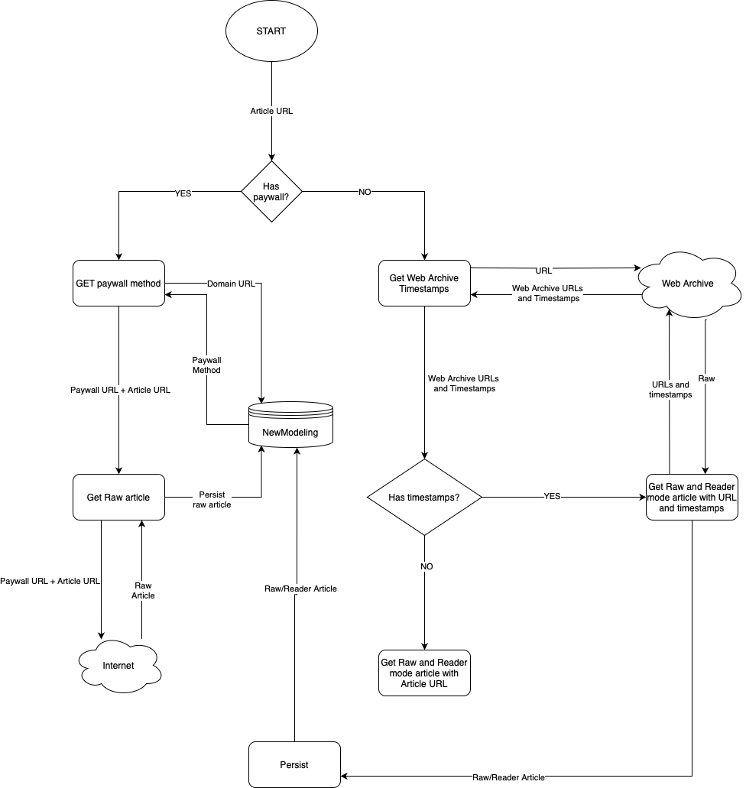

[](https://www.buymeacoffee.com/xctkst44k5o)

# OhWowBREAKINGNews (✨Thread's Version✨)
OhWowBREAKINGNews (✨Thread's Version✨), is a multithreaded scraper, based on Selenium, that helps you to retrieve the content of news or articles you want by specifying its URL. This tool consists of two parts that are executed separately:

1. A scraper that retrieves two formats of the article's HTML: in what we call `raw` format, the entire HTML article and the `reader mode` format, that is, the new's content but opened with the Firefox Reader Mode.
2. A parser that, given the `raw` and/or `reader` format, extracts all the information from both data sources and stores the information in a PostgreSQL table.

# How it works

The tool will prompt several headless Firefox browsers depending of the threads you write in the input. Each thread will perform a get request with the new URL given. To use this tool, you will need to download the Geckodriver to automate tasks with Selenium.

The scraping process is summarized in the following schema



Given the new URL, the tool will check if there are any paywall method for the domain of the given URL. If not, it will retrieve all the timestamps stored in Web Archive. If there are timestamps, the tool will look for those Web Archive URLs that gives HTTP status codes in the range of [200-300]. For every URL, we store all the timestamps in order to avoid requesting several times the Web Archive API.
If there is a paywall, it will retrieve the paywall method to apply from our local database `newmodeling` and then it will convert the original URL to a specific format regarding the paywall method.

If there is not timestamps, the tool will try to access and scrape the input URL.

# Database tables

We setup two databases in order to store the raw/reader mode HTML articles and the parsed content. We split, in two separated files, the required tables for both databases `new_data.sql` and `new_modeling.sql`

We recommend to build backups of your databases and store them in a safe storage system. Just in case that something goes REALLY wrong (you could lose all your data).

## Scraper

To run the scraper we need to create two separate databases: one to store the scraped HTML new and other to persist the parsed content of the new in question.

### New's scraper
#### `new_data.sql` file
In the `new_data.sql`file  there are three tables that will be used in the scraping process:

`dbo.url_domain` stores information about the paywall method to be used in the scraping process for each domain contained within it. If the domain of the candidate URL to be scraped is not in this table, no paywall method will be applied and the scraper will try to retrieve the new using Web Archive. This table contains the following information per domain:

- `id`: The identifier of the domain and subdomains. <br>
- `subdomain_name`: The subdomain. <br>
- `domain_name`: The domain name. <br>
- `suffix`: The suffix of the domain <br>
- `paywall_method`: The paywall method to be applied. Possible values that are used by the scraper: 
    - `no_method` <br>
    - `remove_paywall` <br>
    - `12ft_ladder` <br>
- `checked`: Flag that indicates the domain was manually checked with respect to the existence of paywalls<br>

Once created the table, you should populate it with the script `url_domain.sql`.

`dbo.web_archive_new` stores the information related to the timestamps provided by Web Archive. We store all the timestamps in this table in order to avoid multiples requests to the Web Archive API. The table contains the following information:

- `id`: Unique identifier for the Web Archive timestamps. <br>
- `new_id`: The identifier of the new read in the CSV given in the input of the scraper. <br>
- `potential_urls`: List of timestamps with the URLs and HTTP status codes returned by Web Archive. <br>
- `is_empty`: Flag that indicates whether the URL contains Web Archive timestamps. <br>
- `is_retrieved`: Flag that indicates if the timestamps for the URL were retrieved.

`dbo.preloaded_content` stores the information related to the preloaded datasets in the database. It allows to avoid loading large CSV files in memory if dataset you input in the tool is already loaded in the database. The table contains the following information:

- `id`: Unique identifier for the preloaded dataset <br>
- `data_source`: Name of the preloaded dataset 

`dbo.raw_new` stores the HTML content for the `raw` and `reader` mode formats. For each URL, this table stores the following information:

- `id`: Unique identifier for the raw new.<br>
- `new_id`: The identifier of the new read in the CSV given in the input of the scraper for the new in question.<br>
- `original_url`: The URL to be scraped. <br>
- `raw_new`: The raw HTML content of the new. <br>
- `reader_mode_new`: The reader mode HTML content of the new. <br>
- `is_empty`: Flag that indicates whether the HTML content of URL is empty. <br>
- `is_retrieved`: Flag that indicates if the URL was retrieved. <br>
- `parsed`: Flag that indicates whether the new was parsed.<br>
- `should_rescrape`: Flag that indicates if, after parsing the new, should potentially to be reescraped because `raw` AND `reader` HTML format are empty.

With this, regarding the flag `is_empty` and `is_retrieved`, we have three feasible states of a new (`dbo.raw_new`) or Web Archive timestamp (`dbo.web_archive_new`):

* State 1: `is_empty = false AND is_retrieved = false`. This State indicates that the new/timestamp was not scraped yet. <br>
* State 2: `is_empty = false AND is_retrieved = true`. This State indicates that the new/timestamp was retrieved with content successfully. <br>
* State 3: `is_empty = true AND is_retrieved = true`. This State indicates that the new/timestamp could not be retrieved. <br>

#### `new_modeling.sql` file
In the `new_modeling.sql`file  there is one table to store the parsed content of each new stored in `dbo.raw_new`.

The table `dbo.parsed_new` stores the following information:


- `id`: Unique identifier for the parsed new. <br> 
- `new_id`: The identifier of the new read in the CSV given in the input of the scraper for the new in question. <br> 
- `title`: The title of the new. <br> 
- `body`: The body of the new. <br> 
- `publish_date`: The date that the new was publised. <br> 
- `authors`: List of authors of the new. <br> 
- `language`: Language of the body new<br> 
- `top_image_url`: The top image URL that appears in the new. <br> 
- `media_content_urls`: Media content URLs linked to the new. <br> 
- `is_empty`: Flag that indicates if the parsed new is empty. A new is empty if `title = Null and body = Null and publish_date = Null and authors = Null and top_image_url = Null and media_content_urls = Null`  <br> 

### New's parser

The parser will try to extract the information contained within the `raw_new` and `reader_mode_new` columns from the table `dbo.raw_new`. The retrieved content is stored in the `dbo.parsed_new`. However, we parse the new depending of the existence of content in the `raw_new` and `reader_mode_new` for a URL.

* If `raw_new != '' and reader_mode_new != ''`, that is, if the `raw` and `reader` HTML format have content, then we parse the new using the `raw` and `reader` format. From the `reader` format we retrieve the `title`, `body`, `language` and `authors` fields. On the other hand, from the `raw` format we retrieve the `publish_date`, `top_image_url` and `media_content_urls`.

* If `raw_new == '' and reader_mode_new != ''`, that is, only the `reader` HTML format has content, then we parse the new using only the `reader` format.

* If `raw != '' and reader_mode_new == ''`, that is, only the `raw` HTML format has content, then we parse the new using only the `raw` format.


# Requirements

Just clone the repository and:

1. Install all the dependencies with the command:
   `pip install -r requirements.txt`
2. Install `en_core_web_trf` Spacy model. It is needed to detect Named Entities for the authors of the news. 
   2.1. Run this to do so: `python -m spacy download en_core_web_trf`
2. Install the last version of Mozilla Firefox in your machine.
3. Download the last version of the Geckodriver and place them in the `ohwowbreakingnews` repository folder. https://github.com/mozilla/geckodriver/releases
4. Install PostgresSQL on your machine. I recommend to install `pgadmin` as well, just to run queries over your new's data 😃. https://www.pgadmin.org/download/ </br>
   4.1. Create the databases `newdata` and `newmodeling`. </br>
   4.2. Create the `dbo` schema in both databases. </br>
   4.3. Create the tables contained within `new_data.sql` file for the `newdata` database and `new_modeling.sql` for the `newmodeling` database. </br>
   4.4. Execute the `url_domain.sql` file over the table `dbo.url_domain` in the `newdata` database.

# Format of the CSV of URLs.


The scraper will request you to enter the CSV file path where your URLs are. This file must have a specific (but easy) format: It's just a CSV file created with Pandas with two columns named `id` and `url`. An example of how this CSV must look like is:

```
id,url
38,www.abcd.com
606,www.hahahaha.com
947,www.idontknow.com
```


# Running the tool

Before start running the tool, you will need to configure a little bit the `database.toml` file in order to configure the database connections. Exactly, you need to set your `user` and `password` fields.

To store the scraped and parsed information we consider two database connections:

- `connection`. This database connection aims to persist the HTML content of the tweets/users. That is, it connects to the `newdata` database.
- `parsed_new_connection`. This database connection aims to persist the extracted content of the HTML tweets/users. That is, it connects to the `newmodeling` database.


## New Scraper

You need to run the `new_scraper_main.py` file placed in `./OhWowBREAKINGNews/` folder in your command line with the format:

`python new_scraper_main.py [-c CHUNK_SIZE] [-t THREADS] [-f CSV_FILE] [-s DATASET_NAME]`

where: <br>

- `-c` The number of news that a new's list will contain. <br>
- `-t` The number of threads you want to user when scraping. It equals to the number of browsers that will be opened at the same time. <br>
- `-f` The CSV file with the URLs with the format specified above. <br>
- `-s` The name of the dataset. If you need to include another dataset in your database, you MUST input other name that is not already registered in the database.

In short, `CHUNK_SIZE` splits the entire dataset in lists of `-c` elements and, for each list, a browser is opened. When the list is processed, the browser will close and another new's list will be processed by opening a new browser.


## New Parser

To run the parser, just run go to the folder `src/news_scraper/parser/new_parser_main.py` and run the following command in your terminal:

`python new_parser_main.py`

I would really APPRECIATE that if you find this tool interesting, mention it in your work and let me know!
Happy scraping!